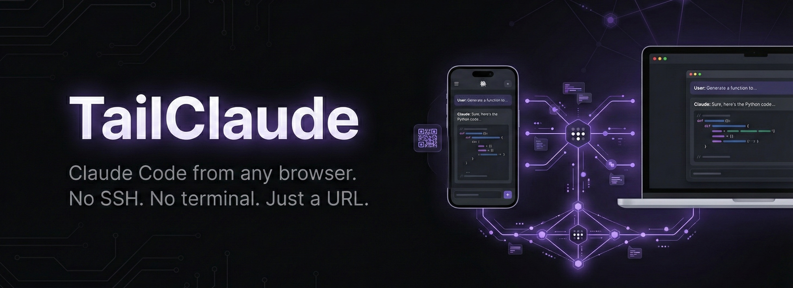

<p align="center">
  
</p>

# TailClaude

**Claude Code from any browser. No SSH. No terminal. Just a URL.**

TailClaude publishes a full Claude Code web interface to every device on your Tailscale tailnet — or the public internet via [Tailscale Funnel](https://tailscale.com/kb/1223/funnel). Powered by the [iii engine](https://github.com/iii-hq/iii).

Scan a QR code from your phone, open the link, and start coding with Claude — **streaming responses, full session history, model switching, cost tracking, and every Claude Code control in a touch-optimized UI**.

## Why TailClaude?

Every "doom coding" setup — SSH, mosh, tmux, Termius, Moshi — still puts you in a terminal. You're still typing on a tiny keyboard, memorizing shortcuts, and managing connections.

**TailClaude removes the terminal entirely.**

| | Terminal (SSH/mosh + tmux) | **TailClaude** |
|---|---|---|
| **Client** | Terminal app + SSH/mosh + tmux | **Any browser** |
| **Phone setup** | Install app, configure keys/auth | **Scan QR code** |
| **Network switch** | mosh helps, SSH drops | **Browser reconnects automatically** |
| **Interface** | Terminal emulator | **Web chat UI with Markdown rendering** |
| **Streaming** | Raw terminal output | **Real-time SSE, token-by-token** |
| **Session history** | `tmux attach` (terminal only) | **Browse ALL sessions (terminal + web)** |
| **Model switching** | Edit CLI flags, restart | **Dropdown: Opus, Sonnet, Haiku** |
| **Permission modes** | CLI flags | **One-click: default, plan, acceptEdits, bypassPermissions** |
| **Cost tracking** | None | **Live tokens + per-message cost ($0.01 · 4.5K in / 892 out)** |
| **Stop mid-response** | Ctrl+C in terminal | **Stop button with instant feedback** |
| **Mobile UX** | Tiny terminal, keyboard shortcuts | **Touch-optimized, responsive, dark theme** |
| **Setup time** | ~15 minutes | **`npm install && iii -c iii-config.yaml`** |

Tailscale handles the secure connection. TailClaude handles everything else.

## Architecture

```text
+-----------------------------------------------------------------+
|  Browser (any device — phone, tablet, laptop)                   |
|  https://your-machine.tail-abc.ts.net                           |
+---------------------------------+-------------------------------+
                                  | HTTPS (auto-cert via Tailscale)
                                  v
+-----------------------------------------------------------------+
|  tailscale serve/funnel :443 -> http://127.0.0.1:3110           |
+---------------------------------+-------------------------------+
                                  |
                                  v
+-----------------------------------------------------------------+
|  Node.js Proxy (port 3110)                                      |
|                                                                 |
|  GET  /              -> Chat UI (streaming, controls, QR)       |
|  GET  /health        -> Engine state + worker metrics + sessions |
|  POST /chat          -> OTel-traced SSE streaming chat           |
|  POST /chat/stop     -> Kill active process + emit lifecycle     |
|  GET  /sessions      -> State-indexed sessions (sub-ms lookup)   |
|  GET  /sessions/:id  -> Load full conversation history           |
|  GET  /qr            -> QR code SVG (real Tailscale URL)         |
|  GET  /settings      -> MCP servers list                         |
|  *                   -> Proxy to iii engine (port 3111)           |
+---------------------------------+-------------------------------+
                                  |
                                  v
+-----------------------------------------------------------------+
|  iii engine (port 3111)                                         |
|                                                                 |
|  State    -> session_index, active_chats, config, published_url |
|  Streams  -> chat event replay buffer (LRU, 100 groups max)    |
|  PubSub   -> chat::started/completed/stopped, session::indexed  |
|  Cron     -> */30 cleanup + */5 session re-index                |
|  OTel     -> distributed tracing on every chat request          |
|  Logger   -> structured logging with trace correlation          |
|  Event: engine::started  -> auto-publish to Tailscale + QR      |
|  Signal: SIGINT/SIGTERM  -> unpublish Tailscale + clean exit    |
+---------------------------------+-------------------------------+
                                  |
                                  v
+-----------------------------------------------------------------+
|  claude -p --output-format stream-json --verbose                |
|  (Claude Code CLI — works with Pro/Max plans)                   |
+-----------------------------------------------------------------+
```

## How It Works

1. **iii engine** runs the state store, event bus, stream layer, and cron scheduler
2. **TailClaude worker** connects via WebSocket and registers functions, triggers, streams, and PubSub subscriptions
3. **Node.js proxy** (port 3110) serves the UI and handles all endpoints with OTel tracing
4. `POST /chat` spawns `claude -p --output-format stream-json --verbose`, wraps the request in an OTel span (model, cost, tokens, duration), writes events to the iii chat stream for replay, mirrors process metadata to `active_chats` state, and emits lifecycle events (`chat::started`, `chat::completed`, `chat::stopped`)
5. `GET /sessions` reads from a state-backed index (sub-ms) instead of scanning the filesystem — the index is refreshed every 5 minutes by cron and updated on `chat::completed` via PubSub
6. `GET /sessions/:id` uses state for O(1) file path lookup, then reads the JSONL history
7. `GET /health` returns engine connection state, worker metrics (CPU, memory, event loop lag), active chats from state, and session count from the index
8. On engine start, auto-publishes to your tailnet via `tailscale serve` and prints a terminal QR code
9. On shutdown (Ctrl+C), unpublishes from Tailscale, unsubscribes engine listeners, and exits cleanly

## Prerequisites

- [iii engine](https://github.com/iii-hq/iii) installed and on your PATH
- [Claude Code CLI](https://docs.anthropic.com/en/docs/claude-code) installed and authenticated
- [Tailscale](https://tailscale.com) installed (optional — works locally without it)
- Node.js 20+

## Quick Start

**3 commands. Under 60 seconds.**

```bash
git clone https://github.com/rohitg00/tailclaude.git
cd tailclaude
npm install
iii -c iii-config.yaml
```

That's it. Open the URL printed in your terminal (or scan the QR code from your phone).

If Tailscale is running, TailClaude auto-publishes to your tailnet with HTTPS. No config needed.

### Other Ways to Run

**Run worker separately** (if iii engine is already running):

```bash
npm run dev
```

**Proxy only** (quick testing, no iii engine):

```bash
npx tsx -e 'import{startProxy}from"./src/proxy.ts";startProxy()'
```

### Verify

```bash
curl http://localhost:3110/health    # Proxy health + Tailscale URL + sessions
open http://localhost:3110           # Open the chat UI
curl http://localhost:3110/sessions  # List all sessions with metadata
curl http://localhost:3110/qr        # QR code SVG
```

## Chat UI Features

### Streaming & Chat
- **Real-time SSE streaming** — tokens appear as Claude generates them
- **Stop button** — abort mid-response with visual feedback (kills the claude process)
- **Inline Markdown** rendering (code blocks, bold, italic, lists)
- **Live token counter** — input/output tokens update as Claude streams (`4,521 in / 892 out`)
- **Cost tracking** — per-message cost displayed on completion (`$0.0123 · 4,521 in / 892 out`)
- **Tool use badges** — appear in real-time as Claude invokes tools, even before text arrives

### Session Management
- **Session discovery** — browse ALL Claude Code sessions (terminal + web)
- **Conversation history** — click any session to load full chat history
- **Session naming** — double-click (or long-press on mobile) to rename
- **Auto-restore** — reopening the browser resumes your last session
- **Relative timestamps** — "2h ago", "3d ago" on each session
- **Slug names** — sessions display their Claude Code slug for identification

### Claude Code Controls
- **Model selector** — Opus (default), Sonnet, Haiku
- **Permission modes** — default, plan, acceptEdits, bypassPermissions, dontAsk
- **Effort levels** — low, medium, high
- **Budget control** — set max spend per message
- **System prompt** — append instructions to every message
- **MCP servers** — view configured MCP servers in settings

### Access & Mobile
- **QR code** — scan from phone to instantly access TailClaude
- **Tailscale Funnel** — public HTTPS access (no Tailscale app needed on phone)
- **Mobile-first** — hamburger menu, touch-optimized, responsive layout
- **Dark theme** with purple accents
- **Connection status** with auto-reconnect polling
- **Auth support** — set `TAILCLAUDE_TOKEN` env var to require bearer token (stripped from child processes)

## Project Structure

```text
tailclaude/
├── iii-config.yaml              # iii engine configuration (180s timeout)
├── package.json                 # dependencies (iii-sdk, qrcode)
├── tsconfig.json
└── src/
    ├── iii.ts                   # SDK init + connection state helpers
    ├── hooks.ts                 # useApi, useEvent, useCron, emit helpers
    ├── state.ts                 # State wrapper (scope/key API via iii.trigger)
    ├── streams.ts               # Chat event stream (LRU replay buffer)
    ├── sessions.ts              # State-backed session index with filesystem scan
    ├── metrics.ts               # Shared WorkerMetricsCollector singleton
    ├── proxy.ts                 # HTTP proxy with OTel tracing, structured logging
    ├── index.ts                 # Register functions, streams, PubSub, crons, proxy
    ├── ui.html                  # Chat UI (single file, inline CSS/JS, ~980 lines)
    └── handlers/
        ├── health.ts            # GET /health (engine state + worker metrics)
        ├── setup.ts             # Tailscale auto-publish with terminal QR code
        ├── shutdown.ts          # Graceful shutdown (SIGINT/SIGTERM + unpublish)
        └── cleanup.ts           # Multi-scope cleanup (sessions, chats, index, streams)
```

## Configuration

### Environment Variables

| Variable | Default | Description |
|----------|---------|-------------|
| `III_BRIDGE_URL` | `ws://localhost:49134` | iii engine WebSocket URL |
| `NODE_ENV` | - | Set to `production` to enable UI caching |
| `TAILCLAUDE_TOKEN` | - | Bearer token for proxy auth (recommended for Funnel) |

### iii Modules

The `iii-config.yaml` enables these modules:

| Module | Purpose |
|--------|---------|
| State (KV/file) | Session index, active chats, Tailscale config (`./data/state_store.db`) |
| Streams | Chat event replay buffer with LRU eviction (100 groups, 30min TTL) |
| REST API | HTTP server on port 3111 with CORS (180s timeout) |
| Queue (builtin) | Internal task queue |
| PubSub (local) | Event bus: `chat::started/completed/stopped`, `session::indexed`, `cleanup::completed` |
| Cron (KV) | Multi-scope cleanup (every 30min) + session re-indexing (every 5min) |
| OTel (memory) | Distributed tracing on every chat request (model, cost, tokens, duration) |
| Shell Exec | Auto-run the TypeScript worker (watches `src/**/*.ts`) |

## Tailscale Integration

TailClaude supports two Tailscale modes:

### Tailscale Serve (tailnet only)

Accessible only from devices on your tailnet:

```bash
tailscale serve --bg --yes --https=443 http://127.0.0.1:3110
```

### Tailscale Funnel (public internet)

Accessible from any device — ideal for phone access without installing Tailscale:

```bash
tailscale funnel --bg --yes --https=443 http://127.0.0.1:3110
```

When using Funnel, set `TAILCLAUDE_TOKEN` to prevent unauthorized access.

### Auto-publish on Engine Start

When Tailscale is available, TailClaude automatically:

1. Detects your Tailscale IP and DNS name
2. Checks for existing serve listeners (reuses if already active)
3. Publishes via `tailscale serve` with HTTPS on port 443
4. Verifies the proxy registered via status check (retries up to 3 times)
5. Prints a QR code to the terminal for instant mobile access
6. On shutdown, runs `tailscale serve --https=443 off` to unpublish

If Tailscale is not installed, it runs in local-only mode at `http://127.0.0.1:3110`.

## API Reference

| Endpoint | Method | Auth | Description |
|----------|--------|------|-------------|
| `/` | GET | No | Serve chat UI |
| `/health` | GET | Yes | Engine state, worker metrics, active chats, session count |
| `/chat` | POST | Yes | OTel-traced SSE streaming chat (spawn claude CLI) |
| `/chat/stop` | POST | Yes | Stop active process + emit lifecycle event |
| `/sessions` | GET | Yes | State-indexed sessions with metadata (sub-ms) |
| `/sessions/:id` | GET | Yes | Load full conversation history for a session |
| `/qr` | GET | Yes | QR code SVG of the Tailscale URL |
| `/settings` | GET | Yes | MCP servers and Claude Code config |

### POST /chat Body

```json
{
  "message": "Hello Claude",
  "model": "opus",
  "mode": "default",
  "effort": "high",
  "sessionId": "optional-uuid-to-resume",
  "maxBudget": 5.00,
  "systemPrompt": "You are a helpful assistant"
}
```

## iii Integration

TailClaude deeply integrates every iii engine primitive, making it a real-world reference app for the [iii SDK](https://github.com/iii-hq/iii).

| Primitive | How TailClaude Uses It |
|---|---|
| **State** | Session index (sub-ms lookups), active chat tracking, Tailscale URL cache |
| **Streams** | Chat event replay buffer — each SSE event written to an LRU-evicted stream group per request |
| **PubSub** | `chat::started`, `chat::completed`, `chat::stopped`, `session::indexed`, `cleanup::completed` |
| **Cron** | Multi-scope cleanup every 30min + session re-indexing every 5min |
| **OTel Tracing** | Every `POST /chat` wrapped in a span with model, cost, tokens, duration, exit code |
| **Logger** | Structured logging with trace correlation across proxy, cleanup, shutdown |
| **Connection Monitor** | Engine WebSocket state exposed in `/health` endpoint |
| **Worker Metrics** | CPU, memory, event loop lag, uptime in `/health` via `WorkerMetricsCollector` |

## Background

The "doom coding" movement proved that coding from a phone is real — [Pete Sena](https://medium.com/@petesena), [Emre Isik](https://medium.com/@emreisik95), and [Ryan Bergamini's doom-coding repo](https://github.com/rberg27/doom-coding) showed what's possible with SSH + tmux + Termius. Others improved the connection layer with mosh and Moshi for persistent sessions through network switches.

But every approach still required a terminal client, key management, and tiny-keyboard typing.

TailClaude asks: **what if you didn't need a terminal at all?** One URL, any browser, full Claude Code — with streaming, session history, model switching, and cost tracking that no terminal setup can match.

## License

MIT
